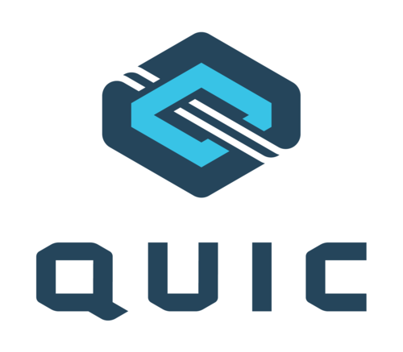

# 为什么需要QUIC

QUIC本身就是一个名字，不是缩略词，它的发音和英语单词“quick”一样。

在很多方面QUIC可以被看作是一种适用于HTTP等协议的、新型的、可靠且安全的传输层协议，并且可以解决基于TCP和TLS的HTTP/2的一些已知的缺点。它是Web传输层协议演变的浪潮中合乎情理的下一朵浪花。

QUIC的用途不局限于HTTP的传输，将数据更快地交付给终端用户的这一愿景，是创造此新型传输协议的最大原因和动力。

那么我们为什么要创建一个新的传输层协议？为什么要基于UDP来实现呢？

## 回顾HTTP/2
HTTP/2协议([RFC 7540](https://httpwg.org/specs/rfc7540.html))于2015年5月发表，从那时起，该协议在互联网和万维网上得到了广泛的实现和部署。

在2018年初，热度排名前一千的网站中几乎有40%运行着HTTP/2，而在Firefox发出的HTTPS请求中，约70%的请求得到了HTTP/2的响应。所有的主流浏览器、服务器以及代理都支持了HTTP/2。

HTTP/2解决了HTTP/1中的许多缺点，随着HTTP/2的引入，Web开发者不需要再用许多种变通方法来解决那些非常麻烦的问题。

HTTP/2的一个主要特性是使用了多路复用机制(multiplexing)，因此它可以通过一个TCP连接发送多个数据流。复用使得事情变得更快更好，它带来了更好的拥塞控制、更充分的带宽利用、更长久的TCP连接--这些都比以前更好了，链路能更容易的实现全速传输。头部压缩技术也减少了带宽的用量。

使用了HTTP/2后，浏览器通常与每个主机进行一个TCP连接，而不再是六个。实际上，与HTTP/2使用的连接聚合(connection coalescing)和“去分片”(desharding)技术还可以进一步缩减连接数。

HTTP/2解决了HTTP的队头阻塞(head of line blocking)问题，也就是客户端不需要等待一个请求完成才能发送下一个请求了。

## TCP队头阻塞
## 用TCP还是UDP
## 协议僵化
## 安全性
## 减少延迟