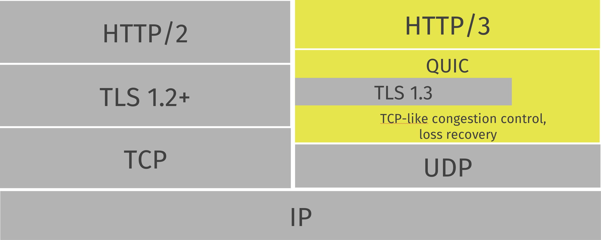

# 协议特点
本章节将从较高的层次来介绍QUIC协议。

下图展示了用作HTTP传输时，HTTP/2(左)和HTTP/3(右)的协议栈对比。

## 基于UDP

### 基于UDP的传输协议

QUIC是基于UDP之上实现的传输协议。如果你不仔细观察，你会觉得QUIC跟UDP报文差不多。

基于UDP的它可以使用UDP端口号来识别制定机器上的特定服务器。

目前已知的所有QUIC实现都位于用户空间，这使得它相较于内核空间能得到更快速的迭代。

### 跑的起来吗？

有些企业和其他网络设置会阻止53（用于DNS）以外的其他端口上的UDP通信。还有一些网络可能会节流，使得QUIC协议的表现慢于TCP的协议。还存在着更多的未知。

在可预见的将来，所有基于QUIC的传输都可能有一个能够优雅地回退到另一个（基于TCP）的替代方法。Google工程师以前曾提到过协议的故障率将低于10%。

### 会好起来吗？

如果QUIC被证明确实是互联网世界的一个有益补充，人们也会希望能够正常使用QUIC，公司可能会重新考虑解决这些障碍。近几年中，QUIC的发展取得了进步，在整个Internet上建立和使用QUIC连接的成功率提高了。

## 可靠性

虽然UDP并不是可靠的传输，但QUIC在UDP之上添加了一层来实现可靠性。它提供了数据包的重新传输、拥塞控制、调整传输节奏以及一些TCP中都不存在的特性。

只要保持连接，通过QUIC从一个端点发送的数据迟早会出现在另一端。

## 数据流

与SCTP、SSH和HTTP/2相类似，QUIC在物理连接内具有独立的逻辑流。许多并行的流可以通过单个连接同时传输数据，而不会影响其他流。

连接是两个端点之间的协商设置，类似于TCP连接的工作方式。QUIC连接建立基于UDP端口和IP地址，但是一旦建立，该连接便由其“连接ID”关联。

通过已建立的连接，任何一方都可以创建流并将数据发送到另一端。数据流是按顺序交付的，并且是可靠的，但是不同的流可能是乱序交付的。

QUIC可以对连接和流提供流量控制。

关于[连接]()和[数据流]()的细节请移步。

## 有序交付

QUIC可以保证单个数据流的有序交付，但是多个数据流可能会乱序。这也就是说单个数据流的传输是按序的，但是多个数据流中接收方收到的顺序可能与发送方的发送顺序不同。

举个例子：服务器传送流A和B到客户端。流A先传输，然后是流B。在QUIC中，丢包只会影响该包所处的流。如果流A发生了丢包，而流B没有，流B将继续传输直到结束，而流A将会进行丢包重传。但在HTTP/2中这不可能发生。

如下图所示，连通两个QUIC端点的单一连接中的黄色与蓝色的数据流。它们互相独立，所以可能乱序到达，但是每个流内的信息一定是按序可靠到达的。

## 快速握手
## TLS 1.3
## 传输层与应用层协议
## QUIC之上的HTTP协议
## QUIC之上的非HTTP协议